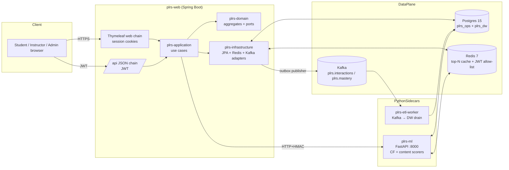
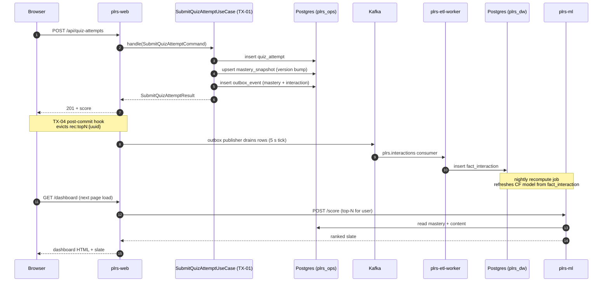

# PLRS — Architecture

References §3.a (component boundaries) and §2.e (data flow) of the
design report. This document is the at-a-glance picture; the report is
the canonical reference.

## High-level component diagram

## Module boundaries

The Java side is hexagonal — one Maven module per layer with ArchUnit
guarding the dependency direction.

| Module                | Depends on             | Holds                                                                 |
| --------------------- | ---------------------- | --------------------------------------------------------------------- |
| `plrs-domain`         | (nothing)              | Aggregates, value objects, repository ports, domain services          |
| `plrs-application`    | domain                 | Use cases (commands + queries), application services, scoring policy  |
| `plrs-infrastructure` | application + domain   | JPA entities + mappers, Redis/Kafka adapters, Flyway migrations, jobs |
| `plrs-web`            | infrastructure         | Spring Boot entrypoint, controllers, filters, Thymeleaf views, security |

ArchUnit rules in `plrs-domain/src/test/java/.../HexagonalArchitectureTest.java`
fail the build if any leaf points the wrong way.

## Data flow — student takes a quiz

Steps (1)–(8) all complete inside one HTTP request; (9)–(11) happen
asynchronously. The cache eviction at TX-04 makes the *next* dashboard
visit trip a fresh slate computation against the new mastery.

## ML interaction

`plrs-application` calls plrs-ml via `MlScorerClient` (HTTP + HMAC SHA-256
on `X-Plrs-Signature`). The endpoints used:

- `POST /cf/similar`     — collaborative-filtering nearest-N items
- `POST /content/score`  — content-based vector score
- `POST /score`          — composite blend (used by the live recommender)
- `POST /eval/run`       — offline evaluation harness (admin-triggered)

The composite blender lives **inside the JVM** as a Spring service; the
Python service exposes the model artefacts and the evaluation
machinery. If plrs-ml is down, the in-process Composite scorer falls
back to the deterministic content-based path (verified by
`test/chaos/ml_down.sh`).

## Operational topology

- The JVM, Postgres, and Redis are critical. Their NFR-9 recovery
  budget is 30 s; verified by `test/chaos/postgres_restart.sh` (Hikari
  retry).
- plrs-ml, Kafka, plrs-etl-worker are non-critical. Per NFR-11,
  recommendations and quiz submission still serve 200 with any of them
  down (verified by the corresponding chaos scripts).
- The outbox table makes Kafka decoupling safe: messages persist with
  `delivered_at = NULL` and the publisher drains them on a 5 s tick.

## Where to look next

- Iteration scopes — `README.md` and `CHANGELOG.md`
- Per-step traceability — design report §2.c (FRs), §2.d (NFRs)
- Module boundaries enforcement — `plrs-domain/src/test/java/.../HexagonalArchitectureTest.java`
- Outbox publisher cadence — `plrs.outbox.drain.fixed-delay-ms` in `application.yml`
- Recommender pipeline — `plrs-application/src/main/java/com/plrs/application/recommendation/`
